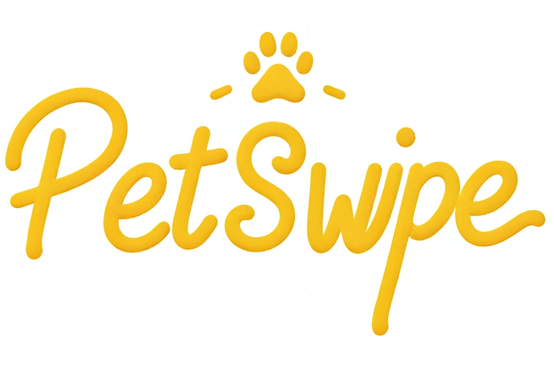

## Overview

PetSwipe is a mobile application designed to facilitate pet adoption. The app allows users to view profiles of pets in need of homes from various shelters and rescue groups. With a familiar swipe interface, users can swipe right to express interest in adopting a pet, saving the profile into a "Saved Pets" list, or swipe left if they wish to pass.

## Features

- **Pet Profiles**: Each pet has a card displaying their picture, name, age, gender, and shelter contact information.
- **Swipe Interface**: Users swipe right to save pets and left to pass.
- **Saved Pets**: A list of pets the user is interested in for future reference.
- **Home Screen**: The landing page where users can start swiping through pet profiles after logging in.

## Technical Stack

- **React Native**: For building the mobile application.
- **Expo**: To facilitate the development process.
- **React Navigation**: To handle navigation within the app, using both stack and bottom tab navigators.
- **Swiper Component**: To enable the swipe functionality.
- **Node.js**: For the backend server.
- **Axios**: To make API requests to fetch pet data.

## Setup and Running

1. Clone the repository.
2. Run `npm install` to install dependencies.
3. Start the app with `expo start`.
4. The backend server expects a local server running on `http://localhost:4000/api/pets`.

## How to Use

1. Upon launching the app, users are greeted with a login screen.
2. Once logged in, users are presented with the home screen populated with pet profiles.
3. Users can swipe through the pet profiles.
4. Swiping right saves the pet's profile into the "Saved Pets" tab accessible via the bottom tab navigator.
5. Swiping left will simply move to the next pet profile.

## Future Scope

- **Extended Pet Details**: More information about the pets' characteristics and needs.
- **User Profiles**: User account creation to save preferences and saved pets.
- **Direct Messaging**: In-app messaging to communicate with shelters.

## Contributions

Contributions are welcome. Please fork the repository and submit a pull request with your features or fixes.

---

This project is intended for educational purposes and aims to help increase the rate of pet adoptions through an easy-to-use mobile interface.

